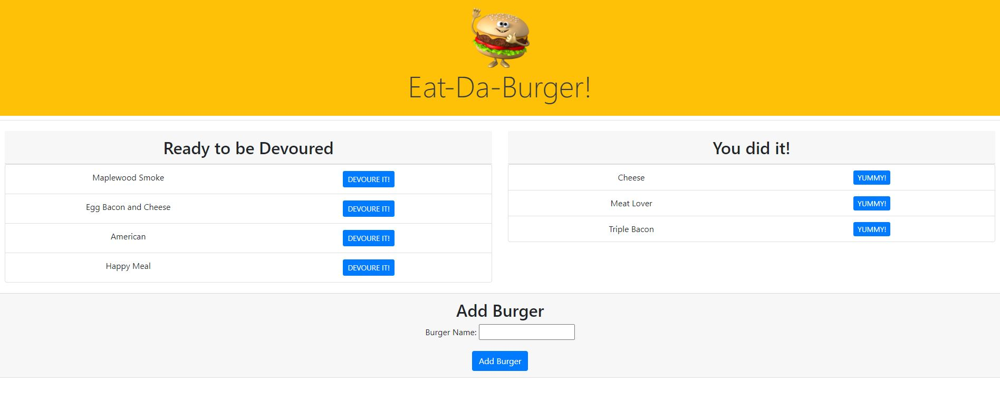

# Eat-Da-Burger


This Eat-Da-Burger app has been developed following the MVC design pattern, implemented with Node.js and Express in the back end and Handlebars, HTML and CSS in the front end. 



[Click to go to live Site](https://github.com/chernanma/Burger)

[Click here to go to Repository](https://github.com/chernanma/Burger)


---
## How it works

To use this App in your local port, you will need to complete the following steps

```
* Clone this repository in your computer

git clone git@github.com:chernanma/Burger.git

* Install all required packages 

npm install

* Run App

node server.js

```

---

## Technologies

- Node.js
- MySQL
- Java Script
- Express
- Handlebars
- Html
- MVC Model

### Packages

- inquirer.js 
- express.js
- express-handlebars.js
- mysql.js

---

## Code 

``` JS

**** MODEL - burger.js ****

const orm = require("../config/orm.js");

var burger = {
    selectAll: function(cb) {
      orm.selectAll("burgers", function(res) {
        cb(res);
      });
    },
    // The variables cols and vals are arrays.
    insertOne: function(cols, vals, cb) {
      orm.insertOne("burgers", cols, vals, function(res) {
        cb(res);
      });
    },
    updateOne: function(objColVals, condition, cb) {
      orm.updateOne("burgers", objColVals, condition, function(res) {
        cb(res);
      });
    }
  };
  
  // Export the database functions for the controller (catsController.js).
  module.exports = burger;


**** ORM orm.js ****

// Import MySQL connection.
const connection = require("../config/connection.js");

// Helper function for SQL syntax.
// Let's say we want to pass 3 values into the mySQL query.
// In order to write the query, we need 3 question marks.
// The above helper function loops through and creates an array of question marks - ["?", "?", "?"] - and turns it into a string.
// ["?", "?", "?"].toString() => "?,?,?";
function printQuestionMarks(num) {
  var arr = [];

  for (var i = 0; i < num; i++) {
    arr.push("?");
  }

  return arr.toString();
}

// Helper function to convert object key/value pairs to SQL syntax
function objToSql(ob) {
  var arr = [];

  // loop through the keys and push the key/value as a string int arr
  for (var key in ob) {
    var value = ob[key];
    // check to skip hidden properties
    if (Object.hasOwnProperty.call(ob, key)) {
      // if string with spaces, add quotations (Lana Del Grey => 'Lana Del Grey')
      if (typeof value === "string" && value.indexOf(" ") >= 0) {
        value = "'" + value + "'";
      }
      // e.g. {name: 'Lana Del Grey'} => ["name='Lana Del Grey'"]
      // e.g. {sleepy: true} => ["sleepy=true"]
      arr.push(key + "=" + value);
    }
  }

  // translate array of strings to a single comma-separated string
  return arr.toString();
}

// Object for all our SQL statement functions.
var orm = {
  selectAll: function(tableInput, cb) {
    var queryString = "SELECT * FROM " + tableInput + ";";
    connection.query(queryString, function(err, result) {
      if (err) {
        throw err;
      }
      cb(result);
    });
  },
  insertOne: function(table, cols, vals, cb) {
    var queryString = "INSERT INTO " + table;

    queryString += " (";
    queryString += cols.toString();
    queryString += ") ";
    queryString += "VALUES (";
    queryString += printQuestionMarks(vals.length);
    queryString += ") ";

    console.log(queryString);

    connection.query(queryString, vals, function(err, result) {
      if (err) {
        throw err;
      }

      cb(result);
    });
  },
  // An example of objColVals would be {name: panther, sleepy: true}
  updateOne: function(table, objColVals, condition, cb) {
    var queryString = "UPDATE " + table;

    queryString += " SET ";
    queryString += objToSql(objColVals);
    queryString += " WHERE ";
    queryString += condition;

    console.log(queryString);
    connection.query(queryString, function(err, result) {
      if (err) {
        throw err;
      }

      cb(result);
    });
  }  
};

// Export the orm object for the model (cat.js).
module.exports = orm;


**** CONTROLLER - burgers_controller.js ****

const express = require("express");

const router = express.Router();

//Import the model burger.js to use its database functions
const burger = require("../models/burger");


//Create all routers

router.get("/",function(req,res){
    burger.selectAll(function(data){
        let hbsObject = {
            burgers: data
        };
        res.render("index", hbsObject);
    });
});

router.post("/api/burgers",function(req,res){
    burger.insertOne(["burger_name","devoured"],[req.body.burger_name,req.body.devoured], function(result){
        res.json({id: result.insertId});
    });
});

router.put("/api/burgers/:id", function(req,res){
    let condition= "id = " + req.params.id;
    burger.updateOne({devoured: req.body.devoured},
        condition,function(result){
            if (result.changedRows == 0){
                return res.status(404).end();
            }else{
                res.status(200).end();
            }
        });
});


module.exports = router;


**** burger.js ****

$(function(){
    // Onclick event when creating a new burger
    $(".create-form").on("submit", function(event){
        event.preventDefault();
        var newBurger = {
            burger_name: $("#bu").val().trim(),
            devoured : 0
        };
        // POST Call to create a new burger API
        $.ajax("/api/burgers",{
            type: "POST",
            data: newBurger
        }).then(function(){
            console.log("Burger has been created");
            location.reload();
        });
    });    

    // Onclick event when devouring burger
    $(".btn").on("click",function(event){
        let id = $(this).data("id");
        let newDevoured = $(this).data("newdevoured");
        console.log(newDevoured);

        let newBurgerDevoured = {
            devoured: newDevoured

        };
        console.log(newBurgerDevoured);

        // PUT call to API to update status of the burger
        $.ajax("/api/burgers/"+id,{
            type: "PUT",
            data: newBurgerDevoured
        }).then(function(){
            console.log("Burger has been devoured");
            location.reload();
        });
        
    });
});


```


---
## References

- The Node.js fs module, https://nodejs.dev/learn/the-nodejs-fs-module

- npm - Inquirer.js, https://www.npmjs.com/package/inquirer#methods

- Express Handlebars, https://www.npmjs.com/package/express-handlebars

- MySQL, https://www.npmjs.com/package/mysql

- Bootstrap - Framework, https://getbootstrap.com/

